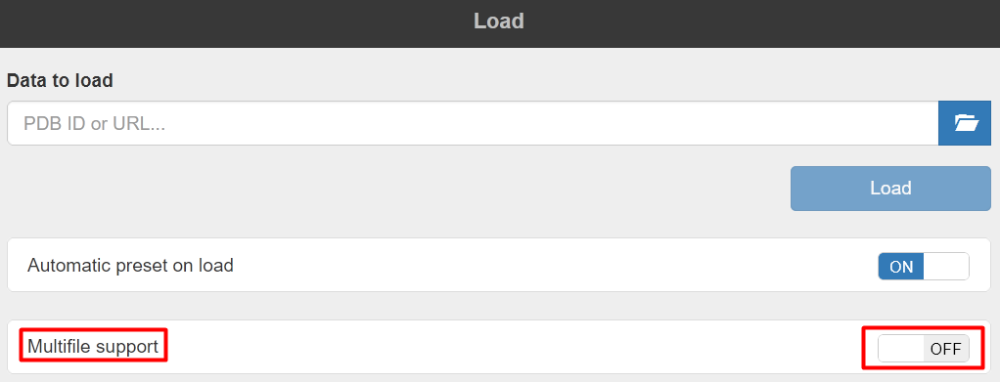
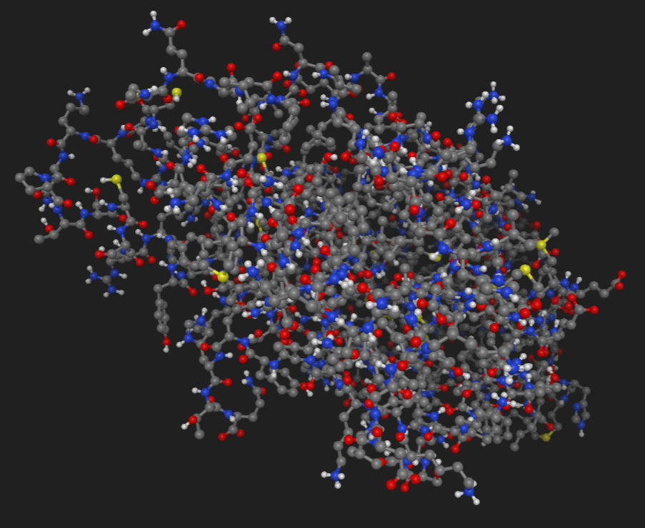
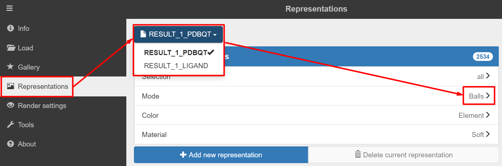
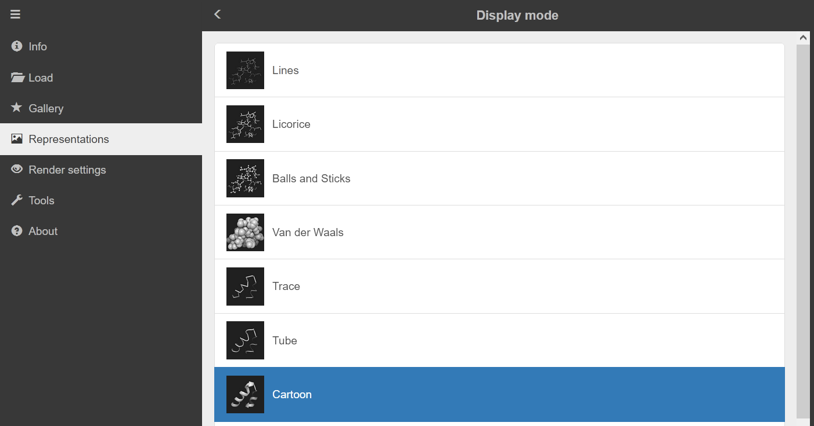
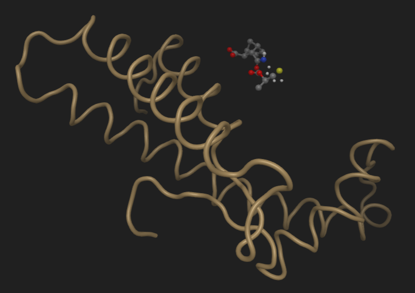

# Miew demo

## Loading molecules/proteins

To load multiple molecules, the Multifile support flag should be ON. When loading the first molecule, it should be turned OFF, so that the scene is cleared before loading.

When ligand is loaded, all models representations are reset to "balls and sticks" (it can be fixed, ofcourse):

So the next step is to fix this, by setting the protein's representation to cartoon in the representations menu.
First, select the molecule.

Then select **Cartoon** for **Mode** instead of **Balls**

The result is this (in this case ligand is not aligned to protein, we just used a non-processed files for visuals demonstration):

